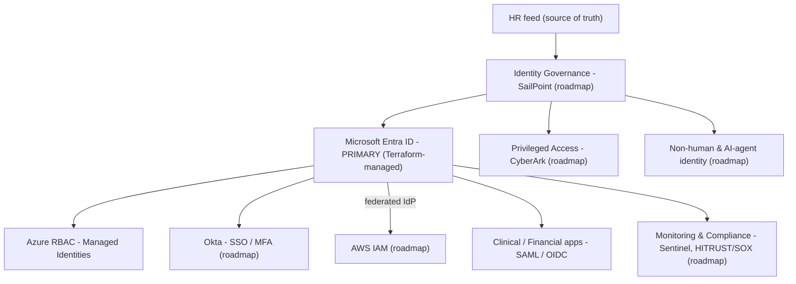

# 01 - Architecture

## Design principle

Identity is managed as code, from a single source of truth, with least privilege enforced by policy and every change auditable. Configuration is version-controlled; nothing is clicked into production by hand.

## Current implementation (built)

### Infrastructure-as-code foundation (`infra/`)

| File | Purpose |
|------|---------|
| `backend.tf` | Remote Terraform state in Azure Blob Storage |
| `providers.tf` | Provider configuration (azuread / azurerm) |
| `main.tf` | Root composition, calls modules |
| `modules/` | Reusable identity modules |

### State backend

Terraform state is stored remotely in Azure, not locally, so the environment is reproducible and safe for collaboration:

- Resource group: `rg-iam-tfstate`
- Storage account: `iamtfstate882613872`
- Container: `tfstate`

Bootstrapped via `scripts/bootstrap_state_storage.sh`. Full detail in STATE_BACKEND.md.

### Identity modules (`infra/modules/`)

| Module | What it does |
|--------|--------------|
| `entra-user` | Automated Entra ID user provisioning (joiner lifecycle) |
| `entra-group` | Entra group creation and membership management (RBAC grouping) |

These two modules are the foundation of the Joiner/Mover/Leaver lifecycle: users provisioned as code, access granted through group membership rather than direct assignment.

## Target architecture (roadmap)

Built today: the Entra + Terraform + Azure-state core (the PRIMARY node and its IaC). Everything marked (roadmap) is planned and tracked in the README build status.

## Why Terraform + Entra as the foundation

Starting at the IaC + Entra layer is deliberate. It establishes the source of truth and the change-control discipline that every later module (governance, federation, PAM) depends on. Building governance on top of a hand-configured directory would mean governing something that cannot be reliably reproduced or audited, the opposite of the goal.